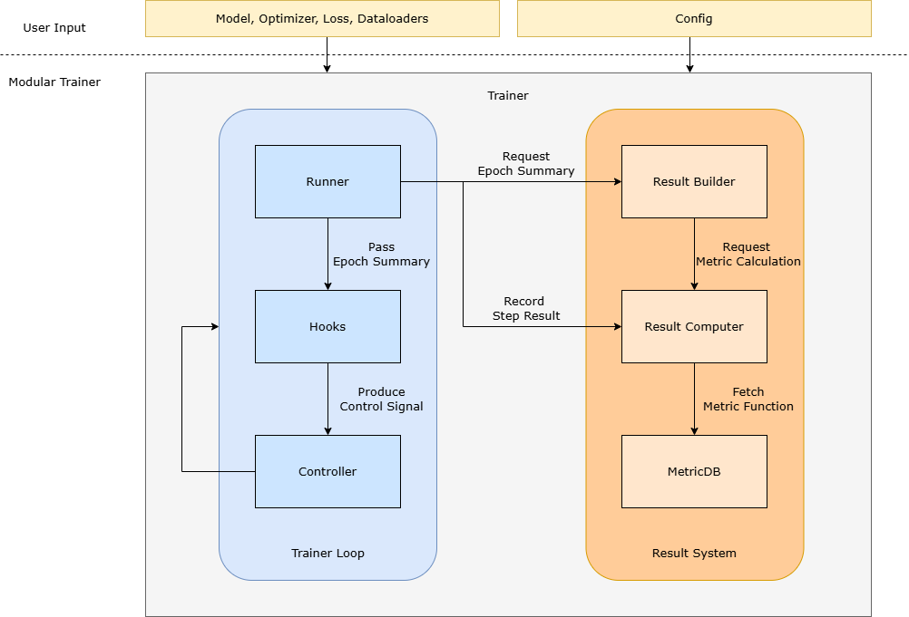

# Modular Trainer

The Modular Trainer is a lightweight training framework designed to provide explicit control over model execution, metric aggregation, and result persistence during training.

This document introduces the architectural structure of the Modular Trainer and explains its execution workflow, intended usage patterns, and practical design considerations.

Unlike monolithic training loops, the Modular Trainer separates step-level computation from epoch-level aggregation. This structural separation improves modularity, testability, and clarity of the training process.

> **Repository:** For further details and implementation, please refer to [My GitHub](https://github.com/omeiLab/Modular-Trainer)

---

## Purpose and Scope

The primary objective of the Modular Trainer is to make the training workflow structurally explicit and easy to reason about.

The framework enforces a clear separation between:

- model execution
- intermediate result collection
- metric computation

This separation enables:

- independent testing of components
- extensible metric handling
- controlled experimentation with transparent execution flow

The Modular Trainer is intended for small to medium scale research or educational use cases where understanding and controlling the training process is more important than maximizing automation.

It is *not* designed for large-scale distributed training or highly optimized production environments.

---

## System Architecture

The Modular Trainer is composed of the following core components, each with a clearly defined responsibility:

| Component | Responsibility |
|-----------|----------------|
| **Trainer** | Orchestrates the training process: initializes components, handles user input, and starts execution  |
| **Trainer Loop** | Modular training loop that handles multi-epoch training.
| **Runner** | Executes step-level computation including forward, backward, and optimization within an epoch  |
| **Controller** | Controls the training loop behavior based on runtime signals |
| **Hooks** | Executes auxiliary operations such as logging, early stopping, and checkpointing |
| **Result Collector** | Stores step-level outputs and performs metric computation |
| **Result Builder** | Aggregates step results into epoch-level summaries and maintains training history |
| **MetricDB** | Stores built-in metrics for aggregation and evaluation |


### System Architecture Overview

The diagram below illustrates the high-level architecture of the Modular Trainer and the relationships between its core components.



### Execution Workflow

The following pseudocodes illustrate the workflow of Modular Trainer. During training, **Hooks** are invoked at defined points, and metrics are retrieved from **MetricDB** as needed.

```py
Trainer.build(model, optimizer, loss, loaders, config)
Trainer.run():
    for epoch in epochs:
        Runner.train_one_epoch():
            for batch in train_loader:
                forward_backward()
                ResultCollector.record(train_loss)
        Runner.validate_one_epoch():
            for batch in val_loader:
                forward()
                ResultCollector.record(val_loss)
                ResultCollector.record(preds, trues)
        metrics = ResultCollector.calculate_metrics(MetricDB)
        ResultBuilder.build_summary(metrics)
        Hooks.execute_on_epoch(epoch)
```

### Expected Output
After running `trainer.run()`, the following will be produced:

- Trained model object
- Logged metrics in terminal
- Saved checkpoints if enabled
- Early stopping applied if configured

---

## Usage Guidance (Quick Start)

This section demonstrates how to initialize the Modular Trainer and start the training process.

**Note:** The Modular Trainer currently supports **PyTorch** only.


1. Prepare the following before starting:
    - `model`: your custom model to train
    - `optimizer`: the optimizer for model training
    - `loss_fn`: the loss function
    - `train_loader`: dataloader for training
    - `val_loader`: dataloader for validation
    - `config_path`: path to your configuration file. Refer to the next section for config requirements

2. Construct the trainer:

    ```py
    trainer = Trainer(model, optimizer, loss_fn, train_loader, val_loader, config_path)
    ```

3. Start the training process:

    ```py
    trained_model = trainer.run()
    ```

    The `run()` method executes the full training workflow and returns the trained model upon completion.

**Tip:** **Trainer** is the only interaction interface. All the complex logic related to

- training loops
- metric aggregation
- hooks 

is handled automatically by the system based on the configuration.  

### Config

The config should be a **YAML** file with your customized settings. Below is an example configuration file with default values.
```yaml
trainer:
    num_epochs: 5       # number of epochs to train
    task: regression    # supported: "regression" or "binary"

metrics:                # metrics for evaluation, see next section for valid metrics

log:
    metric: val_loss    # metric to log in terminal, support only 1 metric currently
    verbose: 1          # whether enable logging or not

early_stop:             # early stopping
    patience: 0         # max epochs without improvement before stopping
    metric: val_loss    # metric to monitor
    min_delta: 0.0      # minimum change in the monitored metric to qualify as improvement.

checkpoint:
    metric: val_loss    # metric to monitor
    min_delta: 0.0      # minimum change in the monitored metric to qualify as improvement.
```

### Metrics

Metrics are dynamically retrieved from **MetricDB** and computed at the end of each validation epoch.

The **training loss** (`train_loss`) and **validation loss** (`val_loss`) will be added to the metric list by default, even the config file doesn't specify anything.

The Modular Trainer currently supports the following built-in metrics:

| Category | Metric ID | Description |
|:---|:---|:---|
| **Regression** | `mse` | Mean Squared Error |
| | `rmse` | Root Mean Squared Error |
| | `mae` | Mean Absolute Error |
| | `r2` | Determination Coefficient ($R^2$) |
| **Binary Classification** | `accuracy` | Accuracy |
| | `precision` | Precision |
| | `recall` | Recall |
| | `f1` | F1-Score |
| | `roc-auc` | Receiver Operating Characteristic Area Under Curve |
| | `pr-auc` | Precision-Recall Area Under Curve |
| | `log-loss` | Cross-Entropy Logarithm Loss |

---

## Design Principles

The Modular Trainer is designed with the following principles:

- **Modularity**: each component has a clearly defined responsibility.
- **Separation of concerns**: computation, aggregation, and control logic are decoupled.
- **Config-driven behavior**: training behavior is controlled via YAML configuration.
- **Extensibility**: new metrics and hooks can be added without modifying core logic.
